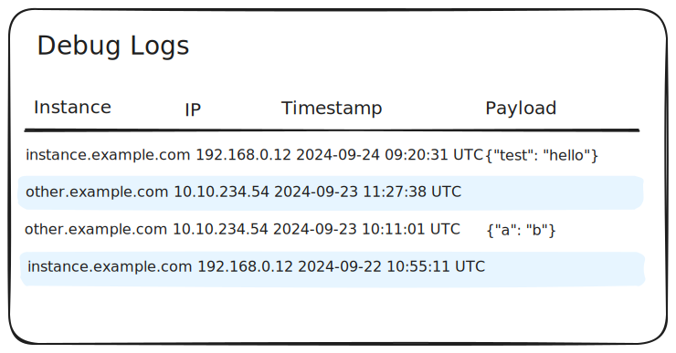
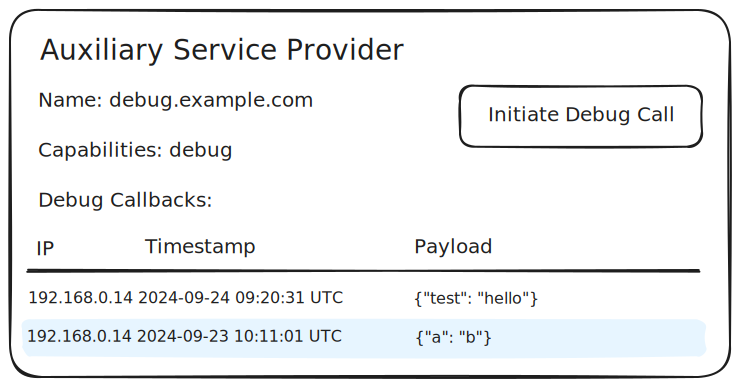

# Debug Provider Specification

## Overview

Specification identifier: `debug`

The debug provider is a
[Fediverse Auxiliary Service Provider](../../general/v0.1/)
that is meant to ease integration of FASP into fediverse software.

It is meant to aid in developing provider integrations into existing
fediverse software and to debug issues with provider setup in general.

## Capabilities

### `callback`

Capability identifier: `callback`

Description:

> The `callback` capability offers a single API endpoint in the provider.
> When called it makes the provider call an API on the server in
> return. The calls are logged to help debug issues with the
> provider/instance setup.

#### Provider API Endpoints

The provider allows an instance to make a HTTP `POST` call to
`/debug/v0/callback/logs`.

Example call:

```http
POST /debug/v0/callback/logs
```

The request body MAY be empty or contain a single JSON object.

The provider MUST log:

* that the request has been made,
* at what time it was made,
* the IP address of the instance that made the request and
* if present the JSON object from the request body 

The provider must then make the API call described in the next section
to the instance.

The provider MUST return a HTTP status code `201` (Created).

#### Instance API Endpoints

The instance allows the provider to make a HTTP `POST` call to
`/debug/v0/callback/responses`.

Example call:

```http
POST /debug/v0/callback/responses
```

The request body MAY be empty, unless the instance included a JSON
object in its call to the provider. In this case the provider MUST
include this object in the request body unchanged.

The instance SHOULD log:

* that the request has been made,
* at what time it was made,
* the IP address of the provider that made the request and
* if present the JSON object from the request body 

This is a strong "SHOULD" but not a "MUST" because skipping this step
might make the implementation inside the instance's software easier
while still providing some value.

The instance MUST return a HTTP status code `201` (Created).

#### User Interface Requirements

The provider MUST offer the instance admin a user interface that
displays the logged information.



The instance MUST provide a button or link to initiate the API call to
the provider. It SHOULD provide a way for the instance admin to see the
logged callbacks from the provider.



## Data Protection

This provider does not receive any personally identifiable or otherwise
sensitive information.
