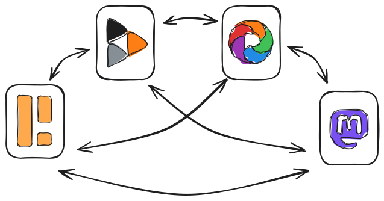

# Fediverse Auxiliary Service Providers: Provider-Instance Interaction

## Introduction

This document introduces the concept of "Fediverse Auxiliary Service
Providers", external services that fediverse server instances can use to
perform a variety of tasks. It defines the way such providers are set-up
within an instance's server software and how the two communicate.

## Fediverse Auxiliary Service Providers

The Fediverse is a decentralized network of different servers, often
called "instances", running different kinds of social media software
that can interoperate by using a shared protocol, ActivityPub.



The different sofware offerings have different use cases, e.g.
micro-blogging or photo sharing, and requirements. Instances, even when
using the same software, can also differ in many ways (e.g. funding,
size of administrative / moderation staff etc.).

That is why some tasks that are useful to many instances regardless of
the software used, are either hard or even impossible for a single
instance to perform. Or every instance performing that task has serious
downsides.

Examples of such tasks are:

* Search and discovery: No single instance has a complete view of the
  full fediverse.
* Link preview generation: All instances fetching a web page to generate
  a link preview once a single post with a link is being federated,
  means the web site gets hammered with a lot of requests in a short
  timeframe.
* SPAM detection: This is not an easy problem to solve and every single
  Fediverse software having to implement their own solution seems
  wasteful.

Fediverse auxiliary service providers are software services that can
assist instances in performing one or more of these tasks. An instance
administrator can decide to "plug-in" one or more providers. Either to
perform different tasks or to complement each other when performing the
same task.


To learn more about seach and discovery related providers, please visit
the [website of the "Fediverse Discovery Providers" project](https://fediscovery.org).

To learn more about trust and safety related use cases, please refer to
[this blog post](https://renchap.com/blog/post/evolving_mastodon_trust_and_safety/).

## Provider Instance Interaction

Regardless of their exact capabilities, *all* providers have a common
way of interacting with fediverse instances. This documents aim to
specify these common interactions up to the point where specific
capabilities can be used. These specific capabilities (search, SPAM
detection etc.) are the subject of their own respective specifications
which all build on this one.

The common interactions are:

1. Registration with the provider
2. Setup of the provider within the fediverse software
3. Display and selection of provider capabilities
4. The ability of the fediverse instance to authenticate with the
provider and call its APIs
5. The ability of the provider to authenticate with the instance and
call its APIs

Please note that 4. and 5. are not the same. Some services might not
need both directions, but many do. Imagine a search provider, where the
instance can perform a search by calling into the provider (4.), but the
provider might also call into the instance to request historic data to
index (5.). Compute-intensive services might be triggerd by an instance
(4.) but only call-back later (5.) with the results once the computation
has finished.

## Terms used

The key words "MUST", "MUST NOT", "SHOULD", "SHOULD NOT" and "MAY" in
this document are to be interpreted as described in
[RFC-2119](https://tools.ietf.org/html/rfc2119.html).

## General Approach and Protocol Basics

This specification aims to define as little new protocol as possible.
Instead, existing protocols and technologies that many fediverse
software projects already use anyway should be re-used wherever
possible. This approach SHOULD be taken by all provider specifications
that build on this one.

Communication between instance and provider MUST use HTTPS.

For authentication and authorization of API calls, provider and instance
use the OAuth 2.0 protocol as defined in
[RFC-6749](https://tool.ietf.org/html/rfc6749.html).

As an instance administrator registers with the provider, the
"authorization code" grant type with PKCE is used to authorize when the
instance calls into the provider.

If the provider calls into the instance, the "client credentials" grant
type is used.

Both instance and provider SHOULD issue refresh tokens and expire access
tokens. Both MUST be able to handle access token expiration and request
a new one using the refresh token.

Custom API calls are HTTPS calls sending, if necessary, JSON data
(`Content-Type: application/json`) and receiving JSON data.

## Registering with a Provider

When an administrator of a fediverse software decides to start using a
provider, they have to first register with the provider. Every provider
might have different requirements when it comes to instance
registration. Depending on the use case different technical,
organizatorial or legal requirements may apply. Thus, this document does
not impose any hard requirements on that process, except for the end
result.

A provider SHOULD document the process how to register as an instance
admin. Even when registration is closed or by invitation-only.

A provider SHOULD list its capabilities and MAY name fediverse software
that is known to be compatible.

A provider MAY provide a web-based form to register. Please see below
for an example.

During registration the provider MAY ask data from the instance
administrator. This MAY include but is not limited to the following:

* Email address and/or other contact data of the adminstrator
* A password of other means of authentication, so the administrator can
  sign-in again later
* URL of the instance(s) to be registered
* Acceptance of terms of service and/or privacy policy

As the result of the registration, a provider MUST present the instance
administrator a set of OAuth 2.0 credentials consisting of a client
identifier and a secret for each registered instance. A provider SHOULD
offer a way to re-generate those in case they get lost.

The following is a sketch of how this may look in the abstract:

Step 1: An instance admin is presented with a registration form


Step 2: Upon successful registration, OAuth 2.0 credentials are
displayed


## Adding a Provider to an Instance

The option to add a new provider SHOULD be part of the user interface
for administrative settings that a fediverse software already has.

To add a new provider, the adminstrator MUST enter the root URL of the
provider, the OAuth 2.0 client identifier and the secret (both obtained
in the previous step). The instance's software MUST validate that all
three values are present and plausible.


After successful submission of this data, the fediverse software MUST
persist it and initiate an OAuth 2.0 authorization flow.

As part of this flow, the administrator will be redirected to the
provider. This means the adminstrator may be asked to authenticate with
the provider again. When the provider is assured the request is
authentic, it MUST present the administrator with a form to confirm the
connection (TODO: connection is not the correct word here), as is
customary in OAuth 2.0.

This also includes a list of OAuth 2.0 scopes that the administrator
MUST be able to select and/or deselect in case more than one is present.
These scopes MUST map to provider capabilities. Refer to the next
section for details.


When the administrator selects scopes and confirms, they will be
redirected back their instance. 

As per the OAuth 2.0 the provider will communicate the successful
authorization including the scopes selected. The instance MUST validate
that it supports these scopes and present the administrator with an
error message if it does not.

If authorization was successful and the selected scopes are supported,
the instance MUST create and persist an OAuth 2.0 application
representing the provider, including a key and a secret. This
application MUST be authorized for the exact same scopes as communicated
by the provider.

It MUST communicate the key and secret to the provider using the (TODO)
API endpoint.

Annotated example request.

The provider MUST respond with a HTTP status code `200` and persist the
key and secret it received.

Until this key and secret have been communicated successfully, a
provider MAY refuse to accept API requests and respond with the HTTP
status code `424` (Failed Dependency) instead.

Fediverse software SHOULD catch this and retry sending the key and
secret in this case.

## Capabilities and OAuth 2.0 scopes

The previous section introduced the idea that a provider's capabilites
map to OAuth 2.0 scopes. This means every capability needs an identifier
that is a valid [OAuth 2.0 scope](https://datatracker.ietf.org/doc/html/rfc6749#section-3.3).

These identifiers MUST adhere to the following pattern:

``` aux:<capability name>:<specification version> ```

As an example, a discovery provider offering the capability to compute
trends adhering to version `1.0` of the specification would offer a
scope named:

``` aux:trends:1.0 ```

## Changing Selected Capabilities

When a provider adds a new capability or when an administrator wants to
use a capability that was not selected during the setup process, the
fediverse software and the provider MUST offer to re-initiate the
authorization process described above to select a different set of
capabilities / scopes.

## HTTP Responses

TODO rate limiting and other common concerns

## Provider specifications

All provider specifications MUST be based on this one and MUST NOT
change any of the requirements stated above.

Every specification MUST include the following:

* A version number
* The names and descriptions of the provided capabilities (scopes)
* The provider's HTTP API endpoints
* The HTTP API an instance needs to implement for the provider to use
  (or a note that none is required)
