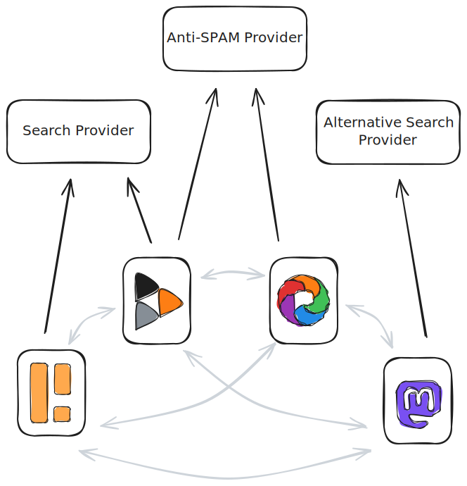

# Fediverse Auxiliary Service Providers: Fediverse Server Interaction

## 01: Introduction

This document introduces the concept of Fediverse Auxiliary Service
Providers ("FASPs"), third-party services that fediverse server software can use to
perform a variety of tasks, and defines the way such FASPs are configured
within fediverse server software and how the two communicate.

### Fediverse Auxiliary Service Providers

The fediverse is a decentralized network of servers running different software
that can interoperate by using the ActivityPub protocol.

The different sofware offerings have different use cases, e.g.
micro-blogging or photo sharing, and different requirements. Fediverse servers, even when
using the same software, may differ in many ways (e.g. number of users,
funding, number of administrative / moderation staff etc.).

Some tasks that are useful to many fediverse servers regardless of
the software used are either hard or even impossible for a single
instance to perform. Or, every instance performing that task independently has serious
downsides.

Examples of such tasks are:

* Search and discovery: No single fediverse server has a complete view of the
  full network, and if it had, that would be very expensive for each server, and result
  in a lot of duplicated content across the network.
* Link preview generation: All fediverse servers fetching a web page to generate
  a link preview once a single post with a link is being federated
  results in the target web site being deluged with requests in a short
  timeframe.
* SPAM detection: This is not an easy problem to solve and every single
  fediverse software having to implement their own solution seems
  wasteful. Also, it really helps to fight this efficiently if able
  to work on data from multiple fediverse servers.

FASPs are software services that can
assist fediverse servers in performing one or more of these tasks. A server
administrator can decide to connect to one or more FASPs, either to
perform different tasks or to complement each other when performing the
same task.

To learn more about search and discovery related FASPs, please visit
the [website of the "Fediverse Discovery Providers" project](https://fediscovery.org).

To learn more about trust and safety related use cases, please refer to
[this blog post](https://renchap.com/blog/post/evolving_mastodon_trust_and_safety/).

### Fediverse Server Interaction

Regardless of their exact capabilities, *all* FASPs have a common
way of interacting with fediverse servers. This document
specifies these common interactions up to the point where specific
capabilities can be used. These specific capabilities (search, spam
detection etc.) are the subject of their own respective specifications
which all build on this one.

The common interactions are:

1. Registration with the FASP
2. Setup of the FASP within the fediverse software
3. Display and selection of FASP capabilities
4. The ability of the fediverse server to authenticate with the
FASP and call its APIs
5. The ability of the FASP to authenticate with the fediverse server and
call its APIs

Please note that 4. and 5. are not the same. Some interactions might not
need both directions, but many do. Imagine a search FASP, where the
fediverse server can perform a search by calling into the FASP (4.), but the
FASP might also call into the fediverse server to request historic data to
index (5.). Compute-intensive services might be triggerd by a fediverse server
(4.) but only call-back later (5.) with the results once the computation
has finished.

---

Next: [02: Protocol Basics](protocol_basics.md)
