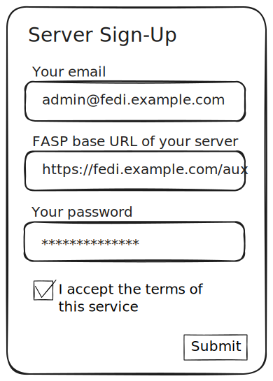
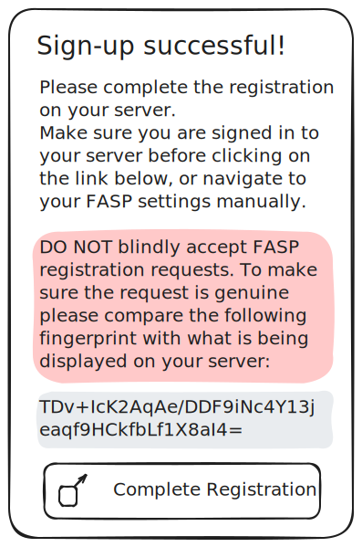
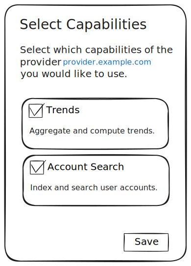

# Fediverse Auxiliary Service Providers: Fediverse Server Interaction

## 03: Registration

### Registering with a FASP

When an administrator of a fediverse server software decides to start using a
FASP, they MAY be required to register with the provider. Every FASP
MAY have different requirements when it comes to fediverse server
registration. Different technical,
organisational or legal requirements may apply. Thus, this document does
not impose any hard requirements on that process, except for the end
result.

A FASP SHOULD document the process a fediverse server should use to register,
even when FASP registration is closed or by invitation only.

A FASP SHOULD list its capabilities and MAY name fediverse software
that is known to be compatible.

A FASP MAY provide a web-based form to register. Please see below
for an example.

During registration the provider MAY request data from the fediverse server
administrator. This MAY include but is not limited to the following:

* Email address and/or other contact data of the adminstrator
* A password of other means of authentication, so the administrator can
  sign-in again later
* Acceptance of terms of service, data processing agreement, and/or privacy policy

As part of the registration process the fediverse server administrator
MUST provide the URL of their server. The FASP MUST use this URL to
discover the base URL for FASP interaction using the
`.well-known/nodeinfo` mechanism as described in [protocol basics](protocol_basics.md).

A successful registration results in the FASP creating an Ed25519
keypair and an unique identifier (ID) for the fediverse server.

After registration, FASP MUST make an HTTP `POST` request to the
fediverse server's `/registration` endpoint.

The payload of that request is a JSON object with the following keys and
values:

* `name`: The name of the FASP - this MUST have been presented to the
  administrator during registration to make it recognizable.
* `baseUrl`: The base URL of the FASP
* `serverId`: The identifier for the server that the FASP generated
* `publicKey`: The public key of the FASP, base64 encoded

An example payload:

```
{
  "name": "Example FASP",
  "baseUrl": "https://fasp.example.com",
  "serverId": "b2ks6vm8p23w",
  "publicKey": "FbUJDVCftINc9FlgRu2jLagCVvOa7I2Myw8aidvkong="
}
```

As a result the fediverse server MUST persist this information as a
request for FASP registration and generate an unique ID for the FASP and
its own Ed25519 keypair for authenticating with the FASP. It MUST then
reply with an HTTP status code `201` (Created) and a JSON object that
contains the following keys and values:

* `faspId`: The identifier the server generated for the FASP
* `publicKey`: The public key of the fediverse server, base64 encoded
* `registrationCompletionUri`: An URI to redirect to in order to finish the
  registration

An example payload:

```json
{
  "faspId": "dfkl3msw6ps3",
  "publicKey": "KvVQVgD4/WcdgbUDWH7EVaYX9W7Jz5fGWt+Wg8h+YvI=",
  "registrationCompletionUri": "https://fedi.example.com/admin/fasps"
}
```

The FASP MUST persist this data and present the administrator with a
page that explains how to finish the registration on their server.

To that end it MAY present a link to the `registrationCompletionUri` it
received.

It MUST display a fingerprint of the FASP's public key for comparison
purposes. The fingerprint is the Base64 encoded SHA-256 hash of the
public key.

The fediverse server MUST present a list of FASP registration requests
to the administrator. This list MUST be accessible via regular means,
i.e. a navigation item in the administration area.

The `registrationCompletionUri` MAY lead to this list, optionally highlighting
or expanding the registration in question. Alternatively it MAY lead to page
that only displays the registration in question.

For each registration request the fediverse server MUST display the
`name` the FASP sent and the fingerprint of its public key.

The administrator MUST be able to either accept or decline a
registration request.

The following is a sketch of how this may look in the abstract:

Step 1: A fediverse server admin is presented with a registration form



Step 2: Upon successful registration, the fingerprint of the public key
and a link / button to the fediverse server is displayed



Step 3: The fediverse servers displays FASP registration requests,
allows to compare name and fingerprint and then to either accept or deny
the requests.


### Selecting Capabilities

FASPs might implement any number of specificatons. As a last step in the
setup process the fediverse server administrator needs to select which
capabilities of the FASP they want to use.

In order to display available capabilities the fediverse server MUST
call the FASP info API endpoint (see
[04: Provider Info](provider_info.md) for a detailed description).

The response includes a list of capability identifiers (see
[05: Provider Specification](provider_specifications.md) for details)
and supported version numbers.

The fediverse software MUST present the administrator with the
capabilities that the FASP supports.



When the administrator enables a capability the fediverse server MUST
notify FASP by making an HTTP `POST` call to the
`/capabilities/<identifier>/<version>/activation` endpoint.
`<identifier>` and `<version>` MUST be replaced with the identifier and
version of the capability.

Example call:

```http
POST /capabilities/debug/2/activation
```

FASP MUST respond with an HTTP status code `204` (No Content) if the
message was successfully received and with an HTTP status code `404`
(Not Found) if the capability is not known or not supported by this
FASP.

When an administrator disables a capability that was formerly enabled
the fediverse server MUST make an HTTP `DELETE` call to the same
endpoint.

Example call:

```http
DELETE /capabilities/trends/1/activation
```

FASP MUST respond with an HTTP status code `204`.

FASP MUST NOT make any calls to a fediverse server's APIs belonging to a
capability that is not enabled.

---

Next: [04: Provider Info](provider_info.md)
