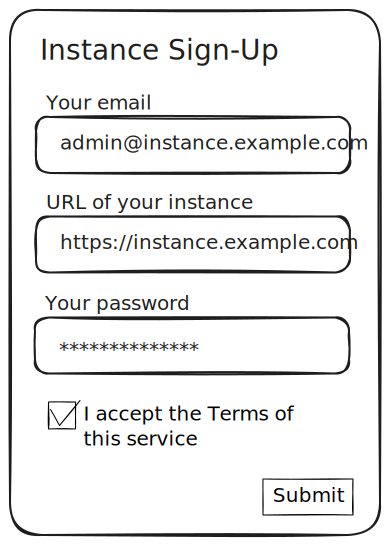
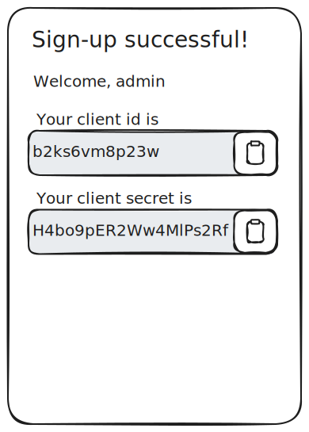
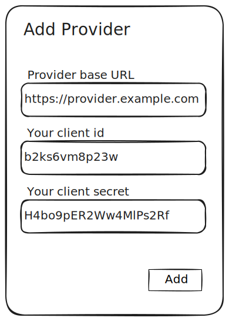

# Fediverse Auxiliary Service Providers: Provider-Instance Interaction

## 03: Registration

### Registering with a Provider

When an administrator of a fediverse software decides to start using a
provider, they have to first register with the provider. Every provider
might have different requirements when it comes to instance
registration. Depending on the use case different technical,
organizatorial or legal requirements may apply. Thus, this document does
not impose any hard requirements on that process, except for the end
result.

A provider SHOULD document the process how to register as an instance
admin. Even when registration is closed or by invitation only.

A provider SHOULD list its capabilities and MAY name fediverse software
that is known to be compatible.

A provider MAY provide a web-based form to register. Please see below
for an example.

During registration the provider MAY ask data from the instance
administrator. This MAY include but is not limited to the following:

* Email address and/or other contact data of the adminstrator
* A password of other means of authentication, so the administrator can
  sign-in again later
* URL of the instance(s) to be registered
* Acceptance of terms of service and/or privacy policy

A successful registration results in the provider creating an OAuth 2.0
application for the instance, including a client identifier (ID) and
secret. It MUST grant the application all the scopes defined here and in
the provider specifications of the capabilities the provider advertises
to the instance (see section [04: Provider Info](provider_info.md)).
Provider specifications MAY define exceptions to this rule.

After the registration, a provider MUST present the instance
administrator a registration token that can be copied into the instance.

The registration token is a JSON Web Token (JWT) that MUST includes the
registered claims `iss` and `sub` and the private claim `sec`. It MAY
contain the registered claim `exp`.

These claims MUST contain the following:

* `iss`: The base URI for API requests to the provider.
* `sub`: The OAuth 2.0 client identifier
* `sec`: The OAuth 2.0 client secret
* `exp`: An optional expiration time

An example payload:

```
{
  "iss": "https://provider.example.com",
  "sub": "b2ks6vm8p23w",
  "sec": "H4bo9pER2Ww4MlPs2Rf",
  "exp": 1726498179
}
```

A provider SHOULD offer a way to re-generate the OAuth credentials and
this token in case it gets lost or an instance needs to be reinstalled
from scratch.

The following is a sketch of how this may look in the abstract:

Step 1: An instance admin is presented with a registration form



Step 2: Upon successful registration, the registration token is
displayed



## Adding a Provider to an Instance

The option to add a new provider SHOULD be part of the user interface
for administrative settings that a fediverse software already has.

To add a new provider, the adminstrator MUST enter / paste the
registration token obtained in the previous step). The instance's
software MUST validate the token before proceeding.

This validation MUST include:

* Ensuring the presence of the `iss`, `sub` and `sec` claims
* Ensuring that `iss` is a valid HTTP(S) URI
* If `exp` is present, ensure the date it represents is not in the past



After successful submission of this data, the fediverse software MUST
persist it and initiate an OAuth 2.0 "client credentials" flow to
obtain an access token. This token can then be used to authenticate
subsequent API calls.

If authorization was successful the instance MUST create and persist an
OAuth 2.0 application representing the provider, including a client ID
and a secret.

It MUST communicate its base URL, the generated client ID and secret to
the provider using the client credentials API endpoint.

Example request:

OAuth 2.0 scope: `setup`

```http
POST /client_credentials
```

Example request body:

```json
{
  "baseURL": "https://instance.example.com",
  "clientId": "kOP2Bc7oP31zM",
  "clientSecret": "pl5z4ciwfEP194MwWziP"
}
```

The provider MUST respond with a HTTP status code `201` (Created)  and
persist the ID, secret and base URL it received.

Until this ID, secret and base URL have been communicated successfully,
a provider MAY refuse to accept API requests and respond with the HTTP
status code `424` (Failed Dependency) instead.

Fediverse software SHOULD catch this and retry sending the data in this
case.

### Selecting Capabilities

A provider software might implement any number of provider
specificatons. That is why as a last step in the setup process the
instance administrator needs to select which capabilities of the
provider they want to use.

In order to display available capabilities the instance MUST
call the provider info API endpoint (see
[04: Provider Info](provider_info.md) for a detailed description).

The response includes a list of capability identifiers (see
[05: Provider Specification](provider_specifications.md) for details)
and supported version numbers.

The instance software MUST present the admin with the subset of these
capabilities that it actually supports.


---

Next: [04: Provider Info](provider_info.md)
