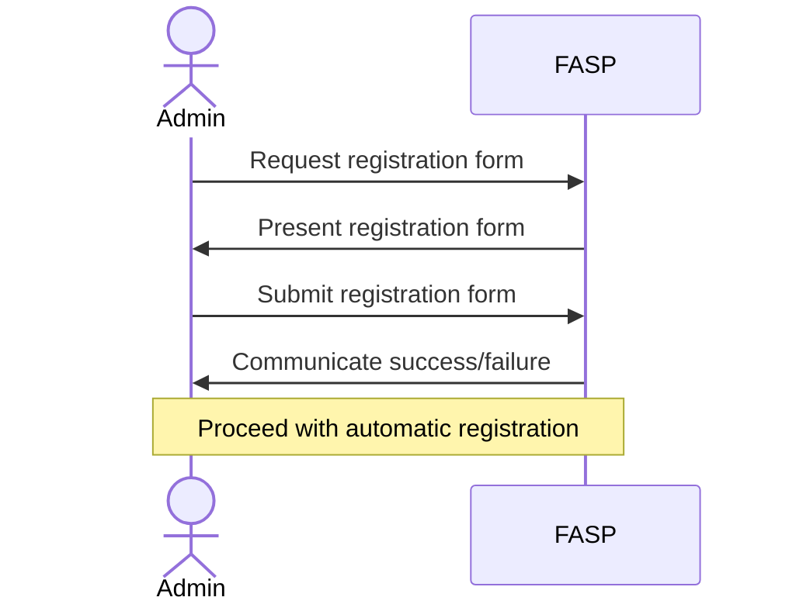
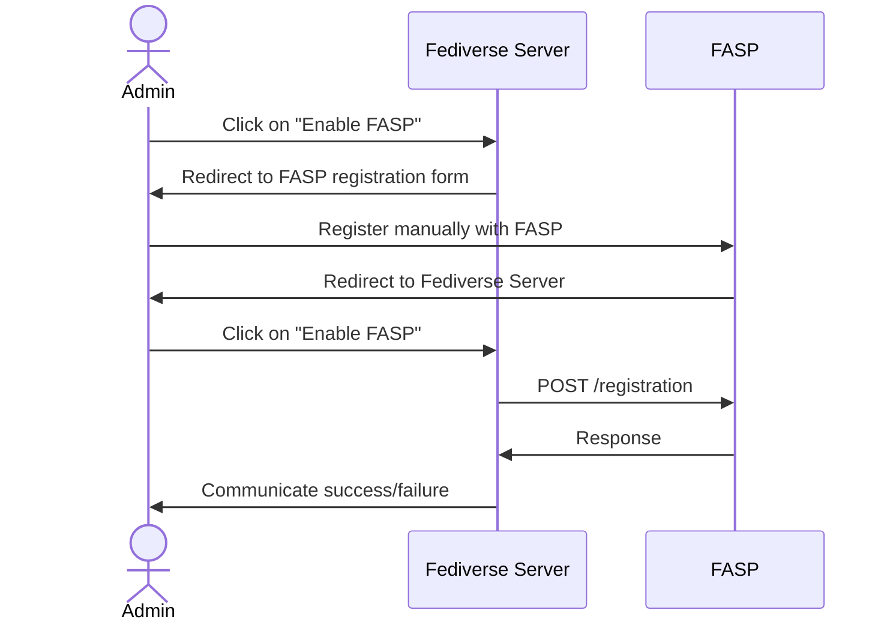
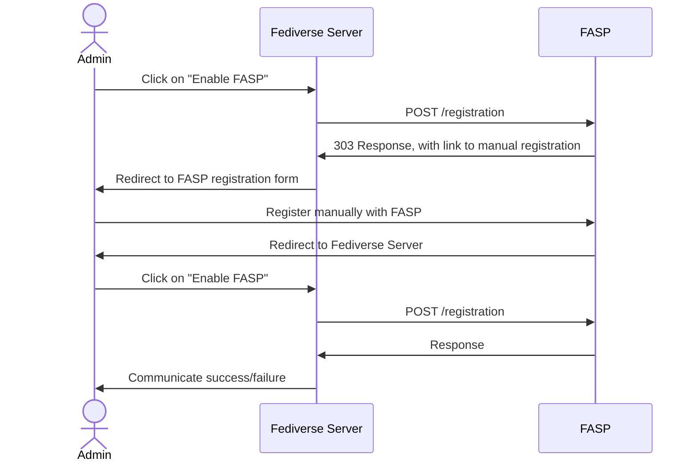
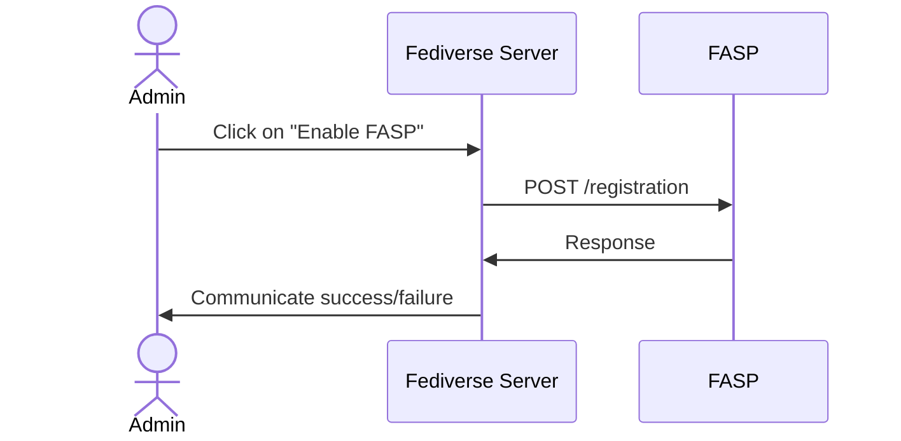
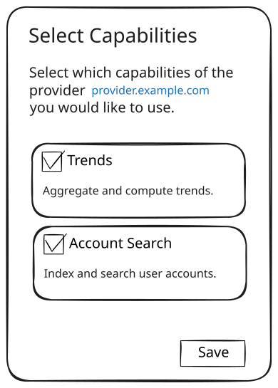

# Fediverse Auxiliary Service Providers: Fediverse Server Interaction

## 03: Registration

### Registering with a FASP

Before fediverse servers can make use of a FASP, they need to register
with it. Registration consists of an optional manual step, where
administrators need to sign up, and a fully automated step, where FASP
and fediverse exchange necessary information.

The manual first step is optional. It MAY be required in many cases as
different technical, organisational or legal requirements may apply. For
example FASP MAY need to ask contact information from administrators,
record acceptance of terms of service or even require payment
information.

FASP that do not require any manual interaction during registration MAY
skip this step and offer only the automated registration.

The registration process usually starts on the fediverse server with one
exception: When manual registration is required, the two steps MAY be
fully decoupled. This is especially useful in scenarios where
administrators want to register a large number of servers in bulk, e.g.
fediverse hosting providers. In these cases, the manual registration can
be performed just once and the per-server automated registration could
run without human intervention.

#### Initiating registration on the fediverse server

Fediverse server software MUST offer a way for administrators to enter
the hostname of a FASP to initiate registration. Fediverse server
software can then use the `.well-known/host-meta.json` mechanism as
described in [protocol basics](protocol_basics.md) to get the FASP's
"base URI" and to see if manual registration is necessary.

It MAY also offer a directory of known FASP to help with discovery.

#### Registration scenarios

##### Fully decoupled manual and automatic registrations

This case is especially useful for bulk registrations of servers as
explained above. Here an administrator can register one or more servers
with a FASP first, before enabling it on said servers.

The process can start from the administrator user interface of the
fediverse server, or directly with the FASP.


```mermaid
sequenceDiagram
    actor Admin
    participant FASP
    Admin->>FASP: Request registration form
    FASP->>Admin: Present registration form
    Admin->>FASP: Submit registration form
    FASP->>Admin: Communicate success/failure
    Note over Admin,FASP: Proceed with automatic registration
```

See [Automatic registration only](#automatic-registration-only) below for the second
part of this process.

##### Integrated manual and automatic registration

When FASP require manual registration and the fediverse server is aware
of this requirement, it can redirect the administrator to the correct
URL on the FASP:


```mermaid
sequenceDiagram
    actor Admin
    participant Fedi as Fediverse Server
    participant FASP
    Admin->>Fedi: Click on "Enable FASP"
    Fedi->>Admin: Redirect to FASP registration form
    Admin->>FASP: Register manually with FASP
    FASP->>Admin: Redirect to Fediverse Server
    Admin->>Fedi: Click on "Enable FASP"
    Fedi->>FASP: POST /registration
    FASP->>Fedi: Response
    Fedi->>Admin: Communicate success/failure
```

When a fediverse server is not aware of the registration requirement,
FASP can communicate this in their response to an attempted automatic
registration:


```mermaid
sequenceDiagram
    actor Admin
    participant Fedi as Fediverse Server
    participant FASP
    Admin->>Fedi: Click on "Enable FASP"
    Fedi->>FASP: POST /registration
    FASP->>Fedi: 303 Response, with link to manual registration
    Fedi->>Admin: Redirect to FASP registration form
    Admin->>FASP: Register manually with FASP
    FASP->>Admin: Redirect to Fediverse Server
    Admin->>Fedi: Click on "Enable FASP"
    Fedi->>FASP: POST /registration
    FASP->>Fedi: Response
    Fedi->>Admin: Communicate success/failure
```

##### Automatic registration only

When there is no manual step, the process becomes very simple:


```mermaid
sequenceDiagram
    actor Admin
    participant Fedi as Fediverse Server
    participant FASP
    Admin->>Fedi: Click on "Enable FASP"
    Fedi->>FASP: POST /registration
    FASP->>Fedi: Response
    Fedi->>Admin: Communicate success/failure
```

Note that this process can be offered via a web UI, but it can also be
fully automated, e.g. via a CLI tool.

#### Manual registration

Manual registration can be a fully bespoke process, modeled after
whatever the FASPs requirements are. It will usually involve one or more
signup forms for an administrator to fill out, but there are no special
requirements except for two:

When a fediverse server offers a link to the manual registration of a
FASP (or redirects the administrators browser there) it MAY append an
HTTP GET parameter to the end of the URL with the key `return_to`. The
value is a URL on the fediverse server.

When a FASP encounters a `return_to` parameter during registration it
SHOULD persist the URL and upon successful registration offer the
administrator a link to go back there.

#### Automatic registration API

To initiate automatic registration with a FASP, fediverse servers MUST
create a new Ed25519 keypair and an unique identifier (ID) for the FASP.

It MUST then make an HTTP `POST` request to the FASP's `/registration`
endpoint.

The payload of that request is a JSON object with the following keys and
values:

* `baseUrl`: The base URL of the fediverse server
* `faspId`: The identifier for the FASP that the server generated
* `publicKey`: The public key that can be used to verify messages coming
  from the server, base64 encoded

An example payload:

```
{
  "baseUrl": "https://fedi.example.com/fasp",
  "faspId": "b2ks6vm8p23w",
  "publicKey": "FbUJDVCftINc9FlgRu2jLagCVvOa7I2Myw8aidvkong="
}
```

As a result the FASP MUST persist this information, generate an
unique ID for the fediverse server and its own Ed25519 keypair for
authenticating with it. It MUST then reply with an HTTP status code
`201` (Created) and a JSON object that contains the following keys and
values:

* `serverId`: The identifier the FASP generated for the server
* `publicKey`: The public key that can be used to verify messages from
  the FASP, base64 encoded

An example payload:

```json
{
  "serverId": "dfkl3msw6ps3",
  "publicKey": "KvVQVgD4/WcdgbUDWH7EVaYX9W7Jz5fGWt+Wg8h+YvI=",
}
```

If the server tried to initiate automatic registration, but the FASP
requires a manual registration step first, it MUST respond with an HTTP
status code 303 and include the URL of the signup form in the `Location`
header.

### Selecting Capabilities

FASPs might implement any number of specifications. As a last step in the
setup process the fediverse server administrator needs to select which
capabilities of the FASP they want to use.

In order to display available capabilities the fediverse server MUST
call the FASP info API endpoint (see
[04: Provider Info](provider_info.md) for a detailed description).

The response includes a list of capability identifiers (see
[05: Provider Specification](provider_specifications.md) for details)
and supported version numbers.

The fediverse software MUST present the administrator with the
capabilities that the FASP supports.



When the administrator enables a capability the fediverse server MUST
notify FASP by making an HTTP `POST` call to the
`/capabilities/<identifier>/<version>/activation` endpoint.
`<identifier>` and `<version>` MUST be replaced with the identifier and
version of the capability.

Example call:

```http
POST /capabilities/debug/2/activation
```

FASP MUST respond with an HTTP status code `204` (No Content) if the
message was successfully received and with an HTTP status code `404`
(Not Found) if the capability is not known or not supported by this
FASP.

When an administrator disables a capability that was formerly enabled
the fediverse server MUST make an HTTP `DELETE` call to the same
endpoint.

Example call:

```http
DELETE /capabilities/trends/1/activation
```

FASP MUST respond with an HTTP status code `204`.

FASP MUST NOT make any calls to a fediverse server's APIs belonging to a
capability that is not enabled.

Fediverse servers MUST NOT persist the change unless the FASP responded
with a `204` status code.

### Revoking registrations

To revoke a registration, fediverse servers can make an HTTP `DELETE`
request to the FASPs `/registration` endpoint.

In case of a successful deletion, FASP MUST respond with an HTTP status
code `204`.

In case of network issues or other temporary errors, fediverse servers
MUST retry this request at least 3 times before persisting the
revocation.

---

Next: [04: Provider Info](provider_info.md)
